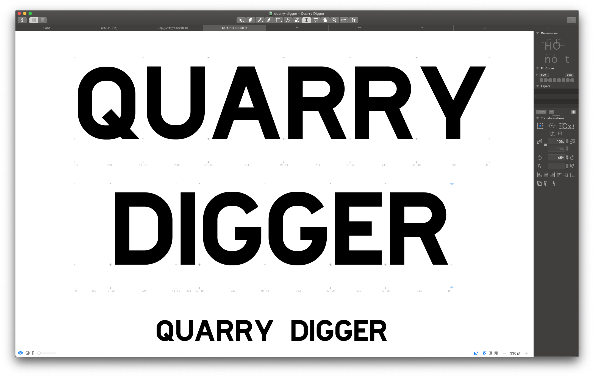

# Quarry Digger

Quarry Digger is a bold sans serif typeface, with very low contrast stroke weight.

Quarry Digger is an experiment in developing a typographic design language from incomplete source materials. The photographic source material for Quarry Digger is the letters 'B', '-' & '3', which were found on the engine block of a wrecked 1930's drag line digger located at Te Puna Quarry Park in Tauranga, New Zealand. 

Quarry Digger is in active development with much still to do.

### Available weights
Bold   

